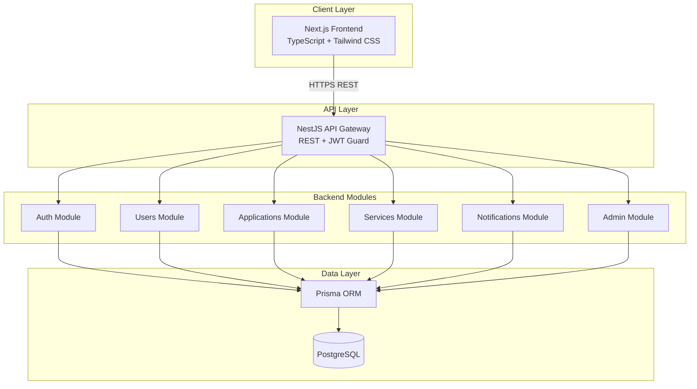
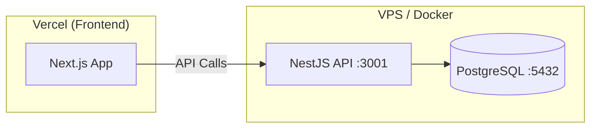
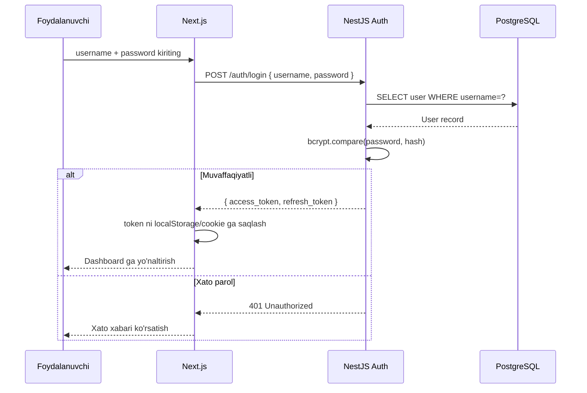
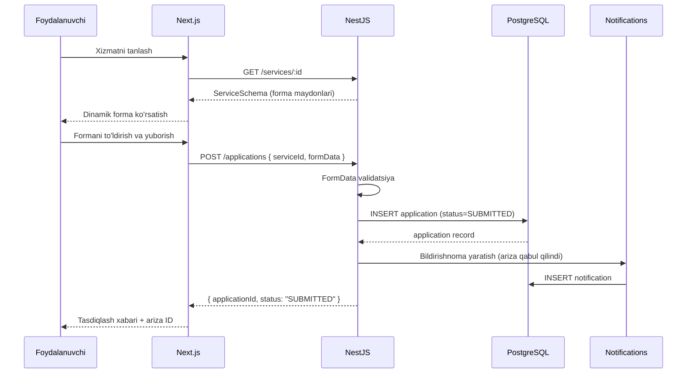
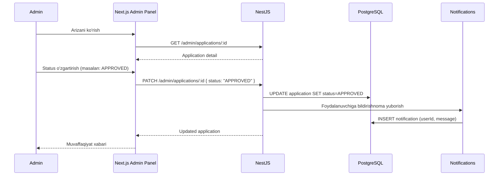

# Design Document: SmartGov — Davlat Xizmatlari Platformasi

## Design Tokens — Rang Palitasi

### Asosiy Ranglar

| Token | Hex | Tailwind nomi | Qo'llanish |
|-------|-----|---------------|-----------|
| `primary` | `#1A5C38` | `green-900` custom | Header, sidebar, asosiy tugmalar |
| `primary-dark` | `#0F3D24` | — | Hover holati |
| `primary-light` | `#2D7A4F` | — | Ikkinchi darajali elementlar |
| `accent` | `#E8610A` | `orange-600` custom | CTA tugmalar, "Ariza yuborish" |
| `accent-dark` | `#C4500A` | — | Accent hover |
| `accent-light` | `#F97316` | — | Bildirishnoma badge |
| `background` | `#FFFFFF` | `white` | Sahifa asosiy foni |
| `surface` | `#F8FAFC` | `slate-50` | Card, panel fonlari |
| `border` | `#E2E8F0` | `slate-200` | Divider, input border |
| `text-primary` | `#0F172A` | `slate-900` | Asosiy matn |
| `text-secondary` | `#64748B` | `slate-500` | Ikkinchi darajali matn |

### Holat Ranglari (Status Colors)

| Holat | Fon | Matn | Badge |
|-------|-----|------|-------|
| `SUBMITTED` — Qabul qilindi | `#EFF6FF` | `#1D4ED8` | Ko'k |
| `IN_REVIEW` — Ko'rib chiqilmoqda | `#FFF7ED` | `#C4500A` | Sabzirang |
| `APPROVED` — Tasdiqlandi | `#F0FDF4` | `#15803D` | Yashil |
| `REJECTED` — Rad etildi | `#FFF1F2` | `#BE123C` | Qizil |

### Qo'llanish Qoidalari

- **Header / Sidebar**: `primary` (#1A5C38) fon, oq matn
- **Asosiy tugma (Primary Button)**: `primary` fon, hover `primary-dark`
- **CTA tugma (Call to Action)**: `accent` (#E8610A) fon, oq matn, hover `accent-dark`
- **Sahifa foni**: `background` (#FFFFFF), card ichida `surface` (#F8FAFC)
- **Focus ring**: `primary-light` (#2D7A4F) 2px outline

---

## Overview

SmartGov — fuqarolarga davlat xizmatlarini onlayn tarzda taqdim etuvchi to'liq stekli veb-platforma. Tizim foydalanuvchilarga tug'ilganlik, talabalik va yashash joyi ma'lumotnomalarini so'rash, ariza holatini real vaqtda kuzatish hamda bildirishnomalar olish imkonini beradi. Admin panel orqali davlat xizmatchilari arizalarni boshqaradi, xizmatlarni sozlaydi va statistikani kuzatadi.

Platforma Next.js (frontend), NestJS (backend), PostgreSQL (ma'lumotlar bazasi), Prisma ORM va JWT autentifikatsiyasiga asoslangan. Arxitektura modulli va kengaytiriladigan tarzda loyihalangan bo'lib, har bir funksional soha mustaqil modul sifatida tashkil etilgan.

---

## Architecture

### Umumiy Tizim Arxitekturasi



### Deployment Arxitekturasi



---

## Sequence Diagrams

### 1. Login va JWT Autentifikatsiya



### 2. Ariza Yuborish Jarayoni



### 3. Admin — Ariza Holatini Yangilash



---

## Components and Interfaces

### 1. Auth Module

**Maqsad**: Foydalanuvchi autentifikatsiyasi va JWT token boshqaruvi.

**Interface**:
```typescript
interface AuthService {
  login(dto: LoginDto): Promise<AuthTokensDto>
  register(dto: RegisterDto): Promise<UserDto>
  refreshToken(token: string): Promise<AuthTokensDto>
  logout(userId: string): Promise<void>
}

interface LoginDto {
  username: string
  password: string
}

interface RegisterDto {
  username: string
  password: string
  fullName: string
  pinfl?: string        // JSHSHIR (ixtiyoriy)
  phoneNumber?: string
}

interface AuthTokensDto {
  accessToken: string   // 15 daqiqa
  refreshToken: string  // 7 kun
}
```

**Javobgarliklar**:
- Parolni bcrypt bilan hash qilish
- JWT access token (15 min) va refresh token (7 kun) yaratish
- Token yangilash mexanizmi
- Role-based access control: `USER` va `ADMIN`

---

### 2. Users Module

**Maqsad**: Foydalanuvchi profilini boshqarish.

**Interface**:
```typescript
interface UsersService {
  getProfile(userId: string): Promise<UserProfileDto>
  updateProfile(userId: string, dto: UpdateProfileDto): Promise<UserProfileDto>
  changePassword(userId: string, dto: ChangePasswordDto): Promise<void>
}

interface UserProfileDto {
  id: string
  username: string
  fullName: string
  pinfl: string | null
  phoneNumber: string | null
  email: string | null
  role: UserRole
  createdAt: Date
}

type UserRole = 'USER' | 'ADMIN'

interface UpdateProfileDto {
  fullName?: string
  phoneNumber?: string
  email?: string
}
```

---

### 3. Services Module (Xizmatlar Katalogi)

**Maqsad**: Mavjud davlat xizmatlarini boshqarish va katalog ko'rsatish.

**Interface**:
```typescript
interface ServicesService {
  findAll(): Promise<ServiceDto[]>
  findById(id: string): Promise<ServiceDetailDto>
  create(dto: CreateServiceDto): Promise<ServiceDto>        // Admin
  update(id: string, dto: UpdateServiceDto): Promise<ServiceDto> // Admin
  delete(id: string): Promise<void>                         // Admin
}

interface ServiceDto {
  id: string
  name: string
  category: ServiceCategory
  description: string
  estimatedDays: number
  isActive: boolean
}

interface ServiceDetailDto extends ServiceDto {
  formSchema: FormFieldSchema[]  // Dinamik forma strukturasi
  requiredDocuments: string[]
}

interface FormFieldSchema {
  key: string
  label: string
  type: 'text' | 'date' | 'select' | 'file' | 'number'
  required: boolean
  options?: string[]  // 'select' turi uchun
}

type ServiceCategory = 
  | 'BIRTH_CERTIFICATE'
  | 'STUDENT_CERTIFICATE'
  | 'RESIDENCE_CERTIFICATE'
```

---

### 4. Applications Module (Arizalar)

**Maqsad**: Ariza yuborish, holat kuzatish va tarix.

**Interface**:
```typescript
interface ApplicationsService {
  submit(userId: string, dto: SubmitApplicationDto): Promise<ApplicationDto>
  findAllByUser(userId: string): Promise<ApplicationDto[]>
  findById(id: string, userId: string): Promise<ApplicationDetailDto>
  trackStatus(applicationId: string): Promise<ApplicationStatusDto>
}

interface SubmitApplicationDto {
  serviceId: string
  formData: Record<string, unknown>  // Dinamik forma ma'lumotlari
  attachments?: string[]              // File URL lar
}

interface ApplicationDto {
  id: string
  serviceId: string
  serviceName: string
  status: ApplicationStatus
  submittedAt: Date
  updatedAt: Date
}

interface ApplicationDetailDto extends ApplicationDto {
  formData: Record<string, unknown>
  statusHistory: StatusHistoryEntry[]
  attachments: string[]
}

interface StatusHistoryEntry {
  status: ApplicationStatus
  changedAt: Date
  comment: string | null
}

type ApplicationStatus = 
  | 'SUBMITTED'     // Qabul qilindi
  | 'IN_REVIEW'     // Ko'rib chiqilmoqda
  | 'APPROVED'      // Tasdiqlandi
  | 'REJECTED'      // Rad etildi
```

---

### 5. Notifications Module

**Maqsad**: Foydalanuvchiga real vaqtda xabarlar yuborish.

**Interface**:
```typescript
interface NotificationsService {
  create(dto: CreateNotificationDto): Promise<NotificationDto>
  findAllByUser(userId: string): Promise<NotificationDto[]>
  markAsRead(id: string, userId: string): Promise<void>
  markAllAsRead(userId: string): Promise<void>
  getUnreadCount(userId: string): Promise<number>
}

interface CreateNotificationDto {
  userId: string
  title: string
  message: string
  type: NotificationType
  referenceId?: string  // applicationId yoki boshqa
}

interface NotificationDto {
  id: string
  title: string
  message: string
  type: NotificationType
  isRead: boolean
  createdAt: Date
  referenceId: string | null
}

type NotificationType = 
  | 'APPLICATION_SUBMITTED'
  | 'STATUS_CHANGED'
  | 'GENERAL'
```

---

### 6. Admin Module

**Maqsad**: Tizimni boshqarish — foydalanuvchilar, arizalar, xizmatlar va statistika.

**Interface**:
```typescript
interface AdminService {
  // Foydalanuvchilar
  getAllUsers(query: PaginationQuery): Promise<PaginatedResult<UserProfileDto>>
  getUserById(id: string): Promise<UserProfileDto>
  updateUserRole(id: string, role: UserRole): Promise<void>
  
  // Arizalar
  getAllApplications(query: ApplicationFilterQuery): Promise<PaginatedResult<ApplicationDto>>
  updateApplicationStatus(id: string, dto: UpdateStatusDto): Promise<ApplicationDto>
  
  // Statistika
  getStatistics(): Promise<StatisticsDto>
}

interface UpdateStatusDto {
  status: ApplicationStatus
  comment?: string
}

interface ApplicationFilterQuery extends PaginationQuery {
  status?: ApplicationStatus
  serviceId?: string
  fromDate?: string
  toDate?: string
}

interface StatisticsDto {
  totalUsers: number
  totalApplications: number
  applicationsByStatus: Record<ApplicationStatus, number>
  applicationsByService: Array<{ serviceName: string; count: number }>
  recentActivity: ActivityEntry[]
}

interface PaginationQuery {
  page: number
  limit: number
  search?: string
}

interface PaginatedResult<T> {
  data: T[]
  total: number
  page: number
  limit: number
  totalPages: number
}
```

---

## Data Models

### PostgreSQL / Prisma Schema

```prisma
model User {
  id           String        @id @default(uuid())
  username     String        @unique
  passwordHash String
  fullName     String
  pinfl        String?       @unique
  phoneNumber  String?
  email        String?       @unique
  role         UserRole      @default(USER)
  createdAt    DateTime      @default(now())
  updatedAt    DateTime      @updatedAt

  applications  Application[]
  notifications Notification[]

  @@map("users")
}

model Service {
  id                String          @id @default(uuid())
  name              String
  category          ServiceCategory
  description       String
  estimatedDays     Int
  isActive          Boolean         @default(true)
  formSchema        Json            // FormFieldSchema[]
  requiredDocuments String[]
  createdAt         DateTime        @default(now())
  updatedAt         DateTime        @updatedAt

  applications Application[]

  @@map("services")
}

model Application {
  id          String            @id @default(uuid())
  userId      String
  serviceId   String
  formData    Json
  attachments String[]
  status      ApplicationStatus @default(SUBMITTED)
  submittedAt DateTime          @default(now())
  updatedAt   DateTime          @updatedAt

  user          User                  @relation(fields: [userId], references: [id])
  service       Service               @relation(fields: [serviceId], references: [id])
  statusHistory ApplicationHistory[]
  notifications Notification[]

  @@map("applications")
}

model ApplicationHistory {
  id            String            @id @default(uuid())
  applicationId String
  status        ApplicationStatus
  comment       String?
  changedAt     DateTime          @default(now())
  changedBy     String?           // Admin userId

  application Application @relation(fields: [applicationId], references: [id])

  @@map("application_history")
}

model Notification {
  id            String           @id @default(uuid())
  userId        String
  title         String
  message       String
  type          NotificationType
  isRead        Boolean          @default(false)
  referenceId   String?
  applicationId String?
  createdAt     DateTime         @default(now())

  user        User         @relation(fields: [userId], references: [id])
  application Application? @relation(fields: [applicationId], references: [id])

  @@map("notifications")
}

enum UserRole {
  USER
  ADMIN
}

enum ServiceCategory {
  BIRTH_CERTIFICATE
  STUDENT_CERTIFICATE
  RESIDENCE_CERTIFICATE
}

enum ApplicationStatus {
  SUBMITTED
  IN_REVIEW
  APPROVED
  REJECTED
}

enum NotificationType {
  APPLICATION_SUBMITTED
  STATUS_CHANGED
  GENERAL
}
```

**Validatsiya Qoidalari**:
- `username`: min 3, max 50 belgi, faqat lotin harflar, raqamlar va `_`
- `password`: min 8 belgi, kamida 1 ta raqam
- `pinfl`: aniq 14 ta raqam (O'zbekiston JSHSHIR standarti)
- `formData`: har bir ariza uchun tegishli `ServiceSchema` ga muvofiq validatsiya
- `status` o'tishi: faqat `SUBMITTED → IN_REVIEW → APPROVED|REJECTED`

---

## Key Functions with Formal Specifications

### `AuthService.login()`

```typescript
async login(dto: LoginDto): Promise<AuthTokensDto>
```

**Preconditions:**
- `dto.username` — bo'sh bo'lmagan string (3–50 belgi)
- `dto.password` — bo'sh bo'lmagan string (min 8 belgi)
- `dto.username` ma'lumotlar bazasida mavjud bo'lishi shart emas (xato holat ham ko'rib chiqiladi)

**Postconditions:**
- Muvaffaqiyatli holat: `accessToken` (15 daqiqa) va `refreshToken` (7 kun) qaytariladi
- `username` topilmasa: `UnauthorizedException` tashlanadi
- Parol mos kelmasa: `UnauthorizedException` tashlanadi
- Input `dto` ga hech qanday mutatsiya qilinmaydi

**Loop Invariants**: N/A

---

### `ApplicationsService.submit()`

```typescript
async submit(userId: string, dto: SubmitApplicationDto): Promise<ApplicationDto>
```

**Preconditions:**
- `userId` — mavjud va aktiv foydalanuvchi
- `dto.serviceId` — mavjud va `isActive: true` bo'lgan xizmat
- `dto.formData` — tegishli xizmat `formSchema` ga muvofiq validatsiyadan o'tgan

**Postconditions:**
- Yangi `Application` yaratiladi, boshlang'ich holat: `SUBMITTED`
- `ApplicationHistory` ga birinchi yozuv qo'shiladi
- `Notification` yaratiladi: `APPLICATION_SUBMITTED`
- Qaytarilgan `ApplicationDto.status === 'SUBMITTED'`
- `dto.formData` ning hech qanday maydonlari o'zgartirilmaydi

**Loop Invariants**: N/A

---

### `AdminService.updateApplicationStatus()`

```typescript
async updateApplicationStatus(id: string, dto: UpdateStatusDto): Promise<ApplicationDto>
```

**Preconditions:**
- `id` — mavjud ariza identifikatori
- `dto.status` — ruxsat etilgan holat o'tishi: `SUBMITTED → IN_REVIEW → APPROVED | REJECTED`
- Teskari o'tish (`APPROVED → IN_REVIEW`) taqiqlangan

**Postconditions:**
- `Application.status` yangi holatga o'zgartiriladi
- `ApplicationHistory` ga yangi yozuv qo'shiladi (timestamp bilan)
- Ariza egasiga `STATUS_CHANGED` bildirishnomasi yuboriladi
- Holat o'tishi noto'g'ri bo'lsa: `BadRequestException` tashlanadi

**Loop Invariants**: N/A

---

### `NotificationsService.findAllByUser()`

```typescript
async findAllByUser(userId: string): Promise<NotificationDto[]>
```

**Preconditions:**
- `userId` — mavjud foydalanuvchi identifikatori

**Postconditions:**
- Faqat `userId` ga tegishli bildirishnomalar qaytariladi (boshqa foydalanuvchilarning xabarlari ko'rinmaydi)
- `createdAt` bo'yicha kamayish tartibida (eng yangi birinchi)
- Natijalar ro'yxati bo'sh bo'lishi mumkin (bu xato emas)

**Loop Invariants**: N/A

---

## Algorithmic Pseudocode

### Holat O'tishi Validatsiyasi (Status Transition Validation)

```pascal
ALGORITHM validateStatusTransition(currentStatus, newStatus)
INPUT: currentStatus: ApplicationStatus, newStatus: ApplicationStatus
OUTPUT: isValid: boolean

BEGIN
  DEFINE allowedTransitions AS MAP
    "SUBMITTED"  → ["IN_REVIEW"]
    "IN_REVIEW"  → ["APPROVED", "REJECTED"]
    "APPROVED"   → []
    "REJECTED"   → []
  END DEFINE

  IF currentStatus EQUALS newStatus THEN
    RETURN false
  END IF

  allowed ← allowedTransitions[currentStatus]

  IF allowed CONTAINS newStatus THEN
    RETURN true
  ELSE
    RETURN false
  END IF
END
```

**Preconditions:**
- `currentStatus` va `newStatus` — `ApplicationStatus` enum qiymatlari

**Postconditions:**
- `true` faqat ruxsat etilgan o'tish uchun
- Bir xil holatga o'tish har doim `false`

---

### FormData Validatsiyasi

```pascal
ALGORITHM validateFormData(formData, formSchema)
INPUT: formData: Record<string, unknown>
       formSchema: FormFieldSchema[]
OUTPUT: result: { isValid: boolean, errors: string[] }

BEGIN
  errors ← []

  FOR each field IN formSchema DO
    value ← formData[field.key]

    IF field.required AND (value IS NULL OR value IS EMPTY) THEN
      errors.ADD(field.label + " majburiy maydon")
    END IF

    IF value IS NOT NULL THEN
      IF field.type = "date" AND NOT isValidDate(value) THEN
        errors.ADD(field.label + " noto'g'ri sana formati")
      END IF

      IF field.type = "select" AND NOT field.options CONTAINS value THEN
        errors.ADD(field.label + " noto'g'ri tanlov qiymati")
      END IF
    END IF
  END FOR

  IF errors IS EMPTY THEN
    RETURN { isValid: true, errors: [] }
  ELSE
    RETURN { isValid: false, errors: errors }
  END IF
END
```

**Preconditions:**
- `formSchema` — kamida bitta maydondan iborat massiv
- `formData` — `Record<string, unknown>` turi

**Postconditions:**
- Barcha `required` maydonlar tekshiriladi
- Xato bo'lmasa `isValid: true` va bo'sh `errors`
- Xato bo'lsa `isValid: false` va tavsiflovchi `errors`

**Loop Invariants:**
- Har bir iteratsiyada faqat bitta `field` tekshiriladi
- `errors` massivi faqat o'sadi, hech qachon kamaymasligi

---

### Bildirishnoma Yuborish Jarayoni

```pascal
ALGORITHM sendApplicationNotification(application, event)
INPUT: application: Application, event: NotificationEvent
OUTPUT: notification: Notification

BEGIN
  DEFINE templates AS MAP
    "APPLICATION_SUBMITTED" → {
      title: "Ariza qabul qilindi",
      message: "Sizning arizangiz (#" + application.id + ") muvaffaqiyatli yuborildi."
    }
    "STATUS_CHANGED" → {
      title: "Ariza holati o'zgardi",
      message: "Arizangiz holati: " + translateStatus(application.status)
    }
  END DEFINE

  template ← templates[event]

  IF template IS NULL THEN
    THROW Error("Noma'lum bildirishnoma turi: " + event)
  END IF

  notification ← CREATE Notification {
    userId:      application.userId,
    title:       template.title,
    message:     template.message,
    type:        event,
    referenceId: application.id,
    isRead:      false
  }

  SAVE notification TO database

  RETURN notification
END
```

---

## Example Usage

### 1. Login va Token Olish

```typescript
// POST /auth/login
const response = await fetch('/api/auth/login', {
  method: 'POST',
  headers: { 'Content-Type': 'application/json' },
  body: JSON.stringify({ username: 'ali_valiyev', password: 'Parol1234' })
})

const { accessToken, refreshToken } = await response.json()
// accessToken localStorage yoki httpOnly cookie ga saqlanadi
```

### 2. Xizmatlar Katalogini Olish

```typescript
// GET /services
const services = await fetch('/api/services', {
  headers: { Authorization: `Bearer ${accessToken}` }
})
// [{ id, name, category, description, estimatedDays }, ...]
```

### 3. Ariza Yuborish

```typescript
// POST /applications
const application = await fetch('/api/applications', {
  method: 'POST',
  headers: {
    'Content-Type': 'application/json',
    Authorization: `Bearer ${accessToken}`
  },
  body: JSON.stringify({
    serviceId: 'uuid-of-birth-certificate-service',
    formData: {
      childFullName: 'Sardor Rahimov',
      birthDate: '2024-01-15',
      birthPlace: 'Toshkent',
      fatherName: 'Jasur Rahimov',
      motherName: 'Malika Rahimova'
    }
  })
})
// { id, serviceId, status: 'SUBMITTED', submittedAt }
```

### 4. Ariza Holatini Kuzatish

```typescript
// GET /applications/:id
const detail = await fetch(`/api/applications/${applicationId}`, {
  headers: { Authorization: `Bearer ${accessToken}` }
})
// {
//   id, status: 'IN_REVIEW',
//   statusHistory: [
//     { status: 'SUBMITTED', changedAt: '2024-01-15T10:00:00Z' },
//     { status: 'IN_REVIEW', changedAt: '2024-01-16T09:30:00Z' }
//   ]
// }
```

### 5. Admin — Holat Yangilash

```typescript
// PATCH /admin/applications/:id
const updated = await fetch(`/api/admin/applications/${id}`, {
  method: 'PATCH',
  headers: {
    'Content-Type': 'application/json',
    Authorization: `Bearer ${adminAccessToken}`
  },
  body: JSON.stringify({
    status: 'APPROVED',
    comment: 'Barcha hujjatlar to\'g\'ri topildi'
  })
})
// { id, status: 'APPROVED', updatedAt }
```

---

## Correctness Properties

*Property — bu tizimning barcha mumkin bo'lgan bajarilishlarida to'g'ri bo'lishi kerak bo'lgan xususiyat yoki xatti-harakat, ya'ni tizim nima qilishi kerakligi haqidagi formal bayonot. Propertylar insonlar o'qiy oladigan spetsifikatsiyalar va avtomatik tekshiriladigan to'g'rilik kafolatlari o'rtasidagi ko'prik bo'lib xizmat qiladi.*

### Property 1: Holat Mashini To'liqligi (Status Machine Completeness)

*Har qanday* `currentStatus` va `newStatus` kombinatsiyasi uchun `validateStatusTransition` funksiyasi faqat `SUBMITTED → IN_REVIEW`, `IN_REVIEW → APPROVED`, `IN_REVIEW → REJECTED` o'tishlarida `true` qaytarishi kerak; `APPROVED` va `REJECTED` terminal holatlardan istalgan holatga, shuningdek bir xil holatga o'tish hamda barcha teskari o'tishlar `false` berishi shart.

**Validates: Requirements 6.1, 6.3, 6.4, 12.1, 12.2, 12.3**

### Property 2: Ma'lumot Izolyatsiyasi (Data Isolation)

*Har qanday* ikkita turli `userId` uchun: birinchi foydalanuvchi tomonidan qaytarilgan arizalar, bildirishnomalar va profil ma'lumotlari hech qachon ikkinchi foydalanuvchiga tegishli yozuvlarni o'z ichiga olmasligi shart.

**Validates: Requirements 2.1, 5.1, 5.3, 7.1, 7.5**

### Property 3: Ariza Yaratish Invarianti (Application Submission Invariant)

*Har qanday* to'g'ri `userId`, `serviceId` va mos `formData` uchun: ariza muvaffaqiyatli yuborilgandan so'ng `status = SUBMITTED`, `ApplicationHistory` da kamida bitta yozuv mavjud, va `APPLICATION_SUBMITTED` turidagi bildirishnoma yaratilgan bo'lishi shart.

**Validates: Requirements 4.1, 4.2, 4.3**

### Property 4: FormData Immutability (Forma Ma'lumotlarining O'zgarmasligi)

*Har qanday* haqiqiy `formData` bilan yuborilgan ariza uchun: bazaga saqlangan `formData` ni qayta o'qiganda, asl yuborilgan `formData` bilan bit-for-bit ekvivalent bo'lishi shart.

**Validates: Requirements 4.5, 10.4**

### Property 5: FormData Validatsiya Round-Trip (Forma Validatsiyasi)

*Har qanday* `FormFieldSchema` massivi va tegishli to'g'ri `formData` uchun: `validateFormData(formData, schema).isValid = true` bo'lishi va `errors = []` bo'lishi shart; *har qanday* `required: true` maydon uchun bo'sh yoki `null` qiymat berilsa `isValid = false` va `errors` ro'yxati bo'sh bo'lmasligi shart.

**Validates: Requirements 4.4, 13.1, 13.2, 13.3, 13.4**

### Property 6: Holat O'zgarishi Bildirishnoma Kafolati (Notification Guarantee)

*Har qanday* muvaffaqiyatli holat o'zgarishi uchun: ariza egasiga `STATUS_CHANGED` turidagi bildirishnoma yaratilishi va `findAllByUser(application.userId)` da ko'rinishi shart.

**Validates: Requirements 6.2, 7.1**

### Property 7: PINFL va Username Yagonaligi (Uniqueness Invariant)

*Har qanday* ikkita turli foydalanuvchi uchun: `pinfl` maydoni `null` bo'lmagan hollarda ularning `pinfl` qiymatlari, shuningdek `username` qiymatlari bir xil bo'lmasligi shart.

**Validates: Requirements 1.3, 10.3**

### Property 8: Rol Asosida Kirishni Boshqarish (RBAC Invariant)

*Har qanday* `USER` rolidagi foydalanuvchi uchun: `/admin/*` prefiksli istalgan endpointga yuborilgan so'rov `403 Forbidden` qaytarishi shart; autentifikatsiyasiz istalgan himoyalangan endpointga so'rov `401 Unauthorized` qaytarishi shart.

**Validates: Requirements 8.1, 8.2**

### Property 9: Parol Xeshlash Xavfsizligi (Password Hash Security)

*Har qanday* haqiqiy parol uchun: `bcrypt.hash(password)` natijasi asl parol bilan teng bo'lmasligi va `bcrypt.compare(password, hash)` ning natijasi `true` bo'lishi shart (round-trip: hash then verify).

**Validates: Requirements 1.6, 11.1**

### Property 10: Bildirishnomalar markAllAsRead Round-Trip

*Har qanday* foydalanuvchining bildirishnomalar ro'yxati uchun: `markAllAsRead(userId)` chaqirilgandan so'ng `getUnreadCount(userId)` `0` qaytarishi va barcha bildirishnomalarning `isRead = true` bo'lishi shart.

**Validates: Requirements 7.3, 7.4**

### Property 11: Input Validatsiya To'liqligi (Input Validation Completeness)

*Har qanday* `username` uchun: 3 belgidan kam, 50 belgidan ko'p yoki lotin/raqam/`_` dan boshqa belgi o'z ichiga olgan qiymat `400 Bad Request` qaytarishi shart; *har qanday* `password` uchun: 8 belgidan kam yoki raqam o'z ichiga olmagan qiymat `400 Bad Request` qaytarishi shart.

**Validates: Requirements 1.7, 1.8, 10.1, 10.2**

### Property 12: Aktiv Xizmatlar Filtri Invarianti (Active Services Filter)

*Har qanday* xizmatlar katalogi so'rovida: qaytarilgan barcha xizmatlar `isActive = true` bo'lishi shart; `isActive = false` bo'lgan xizmat hech qachon ro'yxatda ko'rinmasligi shart.

**Validates: Requirements 3.1, 3.5**

---

## Error Handling

### Xato Stsenariylari

| Xato Holati | HTTP Kodi | Xabar | Qayta Tiklash |
|---|---|---|---|
| Noto'g'ri login ma'lumotlari | 401 | "Username yoki parol noto'g'ri" | Foydalanuvchi qayta kirishga urinishi mumkin |
| Muddati o'tgan token | 401 | "Token muddati tugagan" | Refresh token orqali yangilash |
| Ruxsatsiz kirish | 403 | "Bu amalni bajarishga ruxsat yo'q" | Admin bilan bog'lanish |
| Xizmat topilmadi | 404 | "Xizmat topilmadi" | Xizmatlar katalogiga qaytish |
| Noto'g'ri forma ma'lumotlari | 400 | Maydon xatolarining ro'yxati | Foydalanuvchi xatolarni tuzatadi |
| Noto'g'ri holat o'tishi | 400 | "Bu holat o'tishi ruxsat etilmagan" | Admin to'g'ri holatni tanlaydi |
| Server xatosi | 500 | "Ichki server xatosi" | Qayta urinib ko'rish yoki yordam so'rash |

### Global Exception Filter (NestJS)

```typescript
@Catch()
export class GlobalExceptionFilter implements ExceptionFilter {
  catch(exception: unknown, host: ArgumentsHost) {
    const ctx = host.switchToHttp()
    const response = ctx.getResponse<Response>()

    if (exception instanceof HttpException) {
      const status = exception.getStatus()
      const errorResponse = exception.getResponse()
      response.status(status).json({
        statusCode: status,
        message: typeof errorResponse === 'string'
          ? errorResponse
          : (errorResponse as any).message,
        timestamp: new Date().toISOString()
      })
    } else {
      response.status(500).json({
        statusCode: 500,
        message: 'Ichki server xatosi',
        timestamp: new Date().toISOString()
      })
    }
  }
}
```

---

## Testing Strategy

### Unit Testing

**Kutubxona**: Jest (NestJS bilan birga keladi)

Har bir `Service` sinfi uchun alohida unit testlar:

```typescript
// auth.service.spec.ts
describe('AuthService', () => {
  it('to\'g\'ri login ma\'lumotlari bilan token qaytarishi kerak', async () => {
    const result = await authService.login({ username: 'test', password: 'Test1234' })
    expect(result.accessToken).toBeDefined()
    expect(result.refreshToken).toBeDefined()
  })

  it('noto\'g\'ri parol bilan UnauthorizedException tashlashi kerak', async () => {
    await expect(
      authService.login({ username: 'test', password: 'wrongpassword' })
    ).rejects.toThrow(UnauthorizedException)
  })
})
```

### Property-Based Testing

**Kutubxona**: `fast-check`

```typescript
import fc from 'fast-check'

// Holat o'tishi xususiyatlari
describe('ApplicationStatus transitions', () => {
  it('SUBMITTED dan faqat IN_REVIEW ga o\'tish mumkin', () => {
    fc.assert(
      fc.property(
        fc.constantFrom('APPROVED', 'REJECTED'),
        (invalidNext) => {
          expect(validateStatusTransition('SUBMITTED', invalidNext)).toBe(false)
        }
      )
    )
  })

  it('yakunlangan holatlardan hech qanday o\'tish bo\'lmasligi kerak', () => {
    fc.assert(
      fc.property(
        fc.constantFrom('APPROVED', 'REJECTED'),
        fc.constantFrom('SUBMITTED', 'IN_REVIEW', 'APPROVED', 'REJECTED'),
        (terminal, any) => {
          expect(validateStatusTransition(terminal, any)).toBe(false)
        }
      )
    )
  })
})
```

### Integration Testing

**Kutubxona**: `@nestjs/testing` + `supertest`

```typescript
// applications.e2e.spec.ts
describe('POST /applications', () => {
  it('to\'g\'ri formData bilan ariza yaratishi kerak', async () => {
    const response = await request(app.getHttpServer())
      .post('/applications')
      .set('Authorization', `Bearer ${userToken}`)
      .send({
        serviceId: testServiceId,
        formData: validBirthCertificateFormData
      })
      .expect(201)

    expect(response.body.status).toBe('SUBMITTED')
    expect(response.body.id).toBeDefined()
  })
})
```

### Frontend Testing

**Kutubxona**: Vitest + React Testing Library (Next.js bilan)

```typescript
// ApplicationForm.test.tsx
describe('ApplicationForm', () => {
  it('majburiy maydonlar bo\'sh bo\'lsa submit tugmasi disabled bo\'lishi kerak', () => {
    render(<ApplicationForm schema={birthCertificateSchema} />)
    const submitBtn = screen.getByRole('button', { name: /yuborish/i })
    expect(submitBtn).toBeDisabled()
  })
})
```

---

## Performance Considerations

- **Pagination**: Barcha ro'yxat endpointlari (arizalar, foydalanuvchilar) `page` va `limit` parametrlarini qo'llab-quvvatlaydi — default `limit: 10`, max `limit: 100`
- **Database Indexing**: `applications.userId`, `applications.status`, `notifications.userId`, `notifications.isRead` maydonlariga indeks qo'yiladi
- **JWT Stateless**: Token validatsiyasi ma'lumotlar bazasiga murojaat qilmasdan amalga oshiriladi — performance uchun optimal
- **Next.js SSR/ISR**: Xizmatlar katalogi sahifasi ISR (Incremental Static Regeneration) orqali 1 soatda bir yangilanadi
- **Lazy Loading**: Admin panelda katta jadvallar virtual scrolling yoki pagination bilan yuklansa yaxshi

---

## Security Considerations

- **Password Hashing**: Barcha parollar `bcrypt` (saltRounds=10) bilan hash qilinadi — teskari kriptografiya mumkin emas
- **JWT Secret**: `process.env.JWT_SECRET` muhit o'zgaruvchisida saqlanadi, kodga hardcode qilinmaydi
- **CORS**: Backend faqat `FRONTEND_URL` dan kelgan so'rovlarni qabul qiladi
- **Rate Limiting**: Login endpointida `@nestjs/throttler` orqali 5 daqiqada 10 ta urinish cheklovi
- **Input Sanitization**: Barcha foydalanuvchi kiritgan ma'lumotlar `class-validator` DTOlar orqali validatsiya qilinadi
- **Authorization Guard**: Har bir himoyalangan route `@UseGuards(JwtAuthGuard)` va `@Roles('ADMIN')` dekoratorlari bilan himoyalangan
- **SQL Injection**: Prisma ORM parametrlashtirilgan so'rovlar orqali SQL injection ni avtomatik oldini oladi
- **Sensitive Data**: Response lardan `passwordHash` maydoni hech qachon qaytarilmaydi

---

## Dependencies

### Backend (NestJS)

| Paket | Versiya | Maqsad |
|---|---|---|
| `@nestjs/core` | ^10.x | NestJS asosi |
| `@nestjs/jwt` | ^10.x | JWT token boshqaruvi |
| `@nestjs/passport` | ^10.x | Autentifikatsiya strategiyalari |
| `passport-jwt` | ^4.x | JWT strategiyasi |
| `@prisma/client` | ^5.x | Database ORM |
| `prisma` | ^5.x | Prisma CLI (dev) |
| `bcrypt` | ^5.x | Parol hash qilish |
| `class-validator` | ^0.14.x | DTO validatsiya |
| `class-transformer` | ^0.5.x | Ob'ekt transformatsiyasi |
| `@nestjs/throttler` | ^5.x | Rate limiting |

### Frontend (Next.js)

| Paket | Versiya | Maqsad |
|---|---|---|
| `next` | ^14.x | React framework |
| `react` | ^18.x | UI kutubxonasi |
| `typescript` | ^5.x | Type safety |
| `tailwindcss` | ^3.x | CSS framework |
| `axios` | ^1.x | HTTP client |
| `zustand` | ^4.x | State management |
| `react-hook-form` | ^7.x | Forma boshqaruvi |
| `zod` | ^3.x | Schema validatsiya |

### Testing

| Paket | Maqsad |
|---|---|
| `jest` | Unit testing (backend) |
| `supertest` | Integration testing |
| `fast-check` | Property-based testing |
| `vitest` | Unit testing (frontend) |
| `@testing-library/react` | React component testing |
